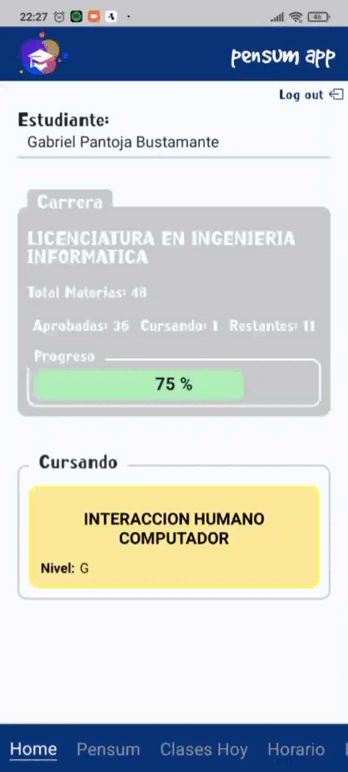

<p
  align="center"
>
  
</p>

**_Pensum App_** es una app que proporcionar una serie de herramientas que puedan ayudar a los estudiantes de la UMSS a visualizar su avance en la carrera cursante, a su vez, darle acceso a una eficiente planificación y organización según el cronograma de estudios, proporcionando un organizador de horarios dinámico, adquiriendo un desarrollo profesional desde un punto más objetivo.

## Demo

<p
  align="center"
>
  
</p>

## Características

- [x] Visualizar el avance de la carrera cursante.
- [x] Visualizar el avance de un nivel específico de la carrera cursante.
- [x] Visualizar las materias que se cursan en un nivel específico.
- [x] Visualizar las clases que se tiene en un dia específico.
- [x] Visualizar el horario de clases del estudiante.
- [x] Armar el horario dinámicamente.

## Instalación

**1.** Clonar el repositorio.

```bash
git clone https://github.com/gabriel-pantojab/pensum-app.git
```

**2.** Instalar las dependencias.

```bash
npm install
```

**3.** Instalar la aplicación **Expo Go** en tu dispositivo móvil.

- [Expo Go para Android](https://play.google.com/store/apps/details?id=host.exp.exponent&hl=es_BO&gl=US)
- [Expo Go para iOS](https://apps.apple.com/us/app/expo-go/id982107779)

**4.** Ejecutar el proyecto.

```bash
expo start
```

**5.** Escanear el código QR con la aplicación **Expo Go**.

## Tecnologías

- [React Native](https://reactnative.dev/)
- [Expo](https://expo.io/)
- [Firebase](https://firebase.google.com/)
- [React Router](https://reactrouter.com/)
- [React Hook Form](https://react-hook-form.com/)
- [Async Storage](https://react-native-async-storage.github.io/async-storage/)
